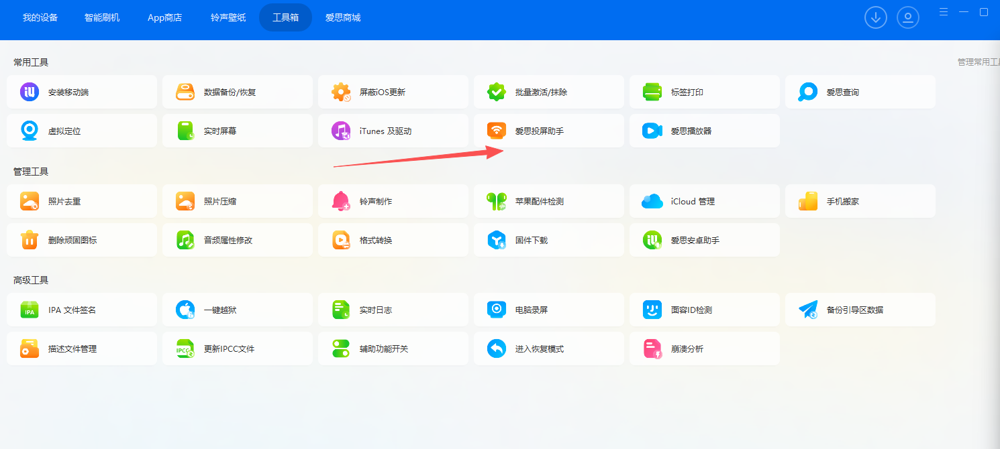
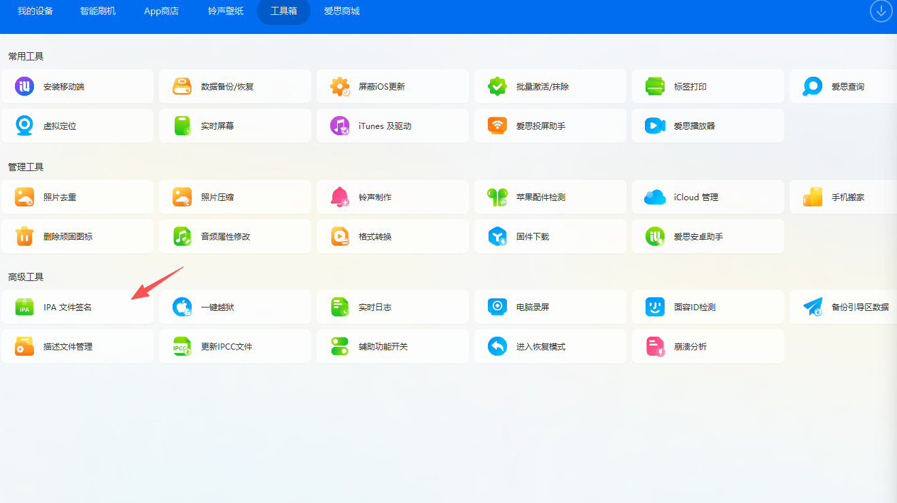

# Cheese iOS 自动化测试环境快速配置指南

本教程帮助你高效完成 Cheese iOS 脱机免越狱自动化测试环境搭建，适用于开发与测试场景。只展示核心流程，详细说明请参考：[详细教程](https://blog.csdn.net/djc3560000009/article/details/149100348?spm=1001.2014.3001.5502)

---

## 1. 环境准备

- 安装最新版 VSCode 或 IDEA
- 准备 iOS 设备及数据线

---

## 2. 文件获取（任选一种方式）

- [官方网盘下载](http://pan.codeocean.net/)
- QQ 群：**710985269**

### 2.1 开发工具插件

- 下载并安装 VSCode/IDEA Cheese 插件

### 2.2 必需安装包

- **cheese.ipa**（主程序）
- **wda.ipa**（自动化依赖，仅wda自动化测试需要）

---

## 3. 插件安装

- 在对应的开发工具(idea/vscode)中安装 Cheese开发 插件

---

## 4. 设备连接与镜像配置

- 安装并启动 **爱思助手**
- 用数据线连接 iOS 设备至电脑
- WDA 自动化测试需用投屏助手刷入开发者镜像（如使用 ESP32HID 可跳过此步）
  

---

## 5. 无 WDA 方案

- 若**无需 WDA**，可使用 Cheese 官方 ESP32HID 方案
- 无需安装 wda.ipa 或刷入镜像

---

## 6. Cheese 主程序安装

- 使用爱思助手签名 cheese.ipa 并安装
  

---

## 7. WDA 安装与签名

- **wda.ipa 请勿直接用爱思签名，否则不可用**
- 必须用 p12 证书签名（有开发者账号可自己生成证书和描述文件使用官方网盘的IPA Resign Tool自签，无可联系作者或淘宝代签）
  
- 签名后通过爱思助手安装

---

## 8. 启动 Cheese 主程序

- 启动 cheese.app，允许所有权限弹窗
- 前台自动显示画中画日志

---

## 9. 启动与验证 WDA

- 启动 wda.app，输入锁屏密码
- 正确签名会弹出一串白色英文，否则闪退（请检查签名或重新签名）

---

## 10. 脚本运行与连接

- 电脑端开启心跳服务
- 手机上填写电脑 IP 地址并连接
- 开发工具弹出手机设备连接成功后，可右键运行脚本代码

---

## 11. 技术支持

- 可加入 QQ 群或联系作者，随时解决你的疑问

---